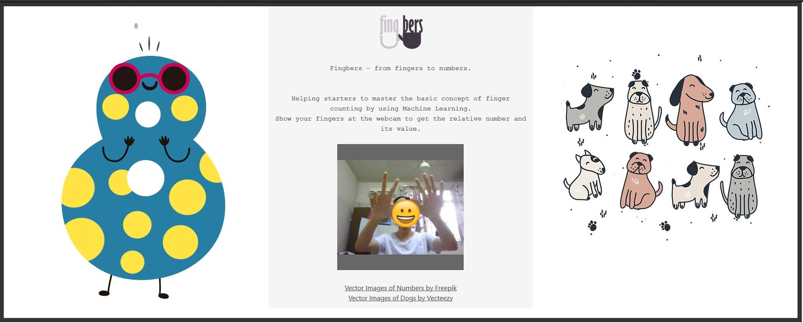

# Fingbers - From fingers to numbers.

A ML based web app developed to help beginners to learn finger counting. :hand::computer:


### How to use?

Show your fingers at the webcam to get the number and its relative value. (0 to 10)


### What is needed?

Install before running Fingbers.

```
$pip install -r requirements.txt
```

### Run Fingbers in localhost

Open fingbers.py located directory, then run in cmd

```
$python fingbers.py
```
Navigate to localhost:5000 on your browser to test out the Fingbers web app.




## Made possible with

* [Handtrack.js](https://victordibia.github.io/handtrack.js/#/) - For hand detection in the browser
* [Tensorflow Object Detection API](https://github.com/tensorflow/models/tree/master/research/object_detection) - For gesture classification in the server


## Authors

* **Alex Wong** - *Initial work* - [Owlullaby](https://github.com/Owlullaby)


## License

This project is licensed under the MIT License.


## Acknowledgments

* This is a development project done along with the completion of project paper "FINGBERS: THE MACHINE LEARNING BASED WEB APP FOR TEACHING FINGER COUNTING USING CRA APPROACH".

